# 💍 ZK Marriage Registry

<div align="center">

**Love in the Zero-Knowledge Era**

*Get married on-chain with complete privacy. Prove your eligibility without revealing your identity.*

[](https://nextjs.org/)
[](https://soliditylang.org/)
[](https://www.typescriptlang.org/)
[](https://getfoundry.sh/)

[🚀 Live Demo](#-quick-start) • [📖 Documentation](#-architecture) • [🔧 Development](#-development) • [🛡️ Security](#-security-considerations)

</div>

---

## ✨ Features

🔒 **Zero-Knowledge Privacy** - Prove marriage eligibility without revealing personal information  
⛓️ **On-Chain Verification** - Smart contract-based marriage registry on Ethereum  
🎯 **zkPassport Integration** - Seamless identity verification with privacy preservation  
💫 **Modern Web3 UX** - Beautiful, intuitive interface with wallet integration  
🔐 **Circom Proofs** - Advanced zk-SNARK technology for cryptographic verification  
📱 **Mobile-First** - QR code scanning for secure identity verification  

## 🏗️ Architecture

```mermaid
graph TB
    A[👤 User with zkPassport] --> B[📱 QR Code Scan]
    B --> C[🔐 Generate ZK Proof]
    C --> D[✅ Verify Eligibility]
    D --> E[💍 Marriage Registry]
    E --> F[⛓️ Smart Contract]
    F --> G[🎉 Marriage Certificate]
    
    style A fill:#ff6b9d
    style G fill:#4ecdc4
    style F fill:#45b7d1
```



### 🔄 Flow Diagram

**Prover** ↔️ **ZK Protocol** ↔️ **Verifier**
- **Prover**: User with zkPassport
- **ZK Protocol**: Circom + Groth16 
- **Verifier**: Smart Contract

---

## 🚀 Quick Start

### Prerequisites

Before you begin, ensure you have the following installed:

1. **Node.js & npm** - [Download here](https://nodejs.org/) or check the [zkPassport SDK example](https://github.com/zkpassport/zkpassport-sdk-example)
2. **Foundry** - Install from [getfoundry.sh](https://getfoundry.sh/)
3. **MetaMask** - Browser wallet with Sepolia testnet ETH
4. **RPC Provider** - Infura, Alchemy, or similar service

### 1. Clone the Repository

```bash
git clone https://github.com/your-username/zk-marriage-registry.git
cd zk-marriage-registry
```

### 2. Install Dependencies

```bash
npm install
```

### 3. Environment Setup

Copy the example environment file and configure it:

```bash
cp .env.example .env
```

Edit your `.env` file:

```bash
# Blockchain Configuration
NEXT_PUBLIC_RPC_URL=https://sepolia.infura.io/v3/YOUR_INFURA_KEY
NEXT_PUBLIC_CHAIN_ID=11155111
NEXT_PUBLIC_MARRIAGE_REGISTRY_ADDRESS=0x...  # Will be filled after deployment

# Deployment (KEEP PRIVATE!)
PRIVATE_KEY=0x...  # Your deployer private key with Sepolia ETH
SEPOLIA_RPC_URL=https://sepolia.infura.io/v3/YOUR_INFURA_KEY

# Optional: For contract verification
ETHERSCAN_API_KEY=your_etherscan_api_key
```

> ⚠️ **Security Warning**: Never commit your private key to version control!

### 4. Deploy Smart Contract

Build and test the contract:

```bash
# Compile the contract
forge build

# Run tests to ensure everything works
forge test
```

Deploy to Sepolia testnet:

```bash
# Deploy the contract (replace with your actual RPC URL)
forge script script/Deploy.s.sol --rpc-url $SEPOLIA_RPC_URL --broadcast --verify
```

📝 **Important**: Copy the deployed contract address from the output and add it to `NEXT_PUBLIC_MARRIAGE_REGISTRY_ADDRESS` in your `.env` file.

### 5. Start the Application

```bash
npm run dev
```

🎉 **Congratulations!** Open [http://localhost:3000](http://localhost:3000) to see your ZK Marriage Registry in action!

### 6. Test the Marriage Flow

1. **Connect Wallet** - Connect MetaMask to Sepolia testnet
2. **Get Married** - Click "💍 Get Married Privately"
3. **Verify Partners** - Both partners scan QR codes with zkPassport app
4. **Create Certificate** - Generate your zero-knowledge marriage certificate
5. **Verify Certificate** - Use the verification page to prove marriage status

---

## 🛠️ Development

### Project Structure

```
├── app/                    # Next.js App Router pages
│   ├── marriage/          # Marriage ceremony page
│   ├── verify/            # Certificate verification page
│   └── api/               # Backend API routes
├── components/            # Reusable React components
├── contracts/             # Smart contracts
├── lib/                   # Utility libraries
├── circuits/              # Circom ZK circuits
└── public/               # Static assets
```

### Smart Contract Functions

The deployed `RealMarriageRegistry` contract provides:

#### Creating a Marriage
```solidity
function createMarriage(
    bytes32 marriageId,
    bytes32 spouse1Nullifier,
    bytes32 spouse2Nullifier,
    bytes32 proof1Hash,
    bytes32 proof2Hash
) external
```

#### Checking Marriage Status
```solidity
function getMarriageStatusByNullifier(bytes32 nullifier) 
    external view returns (bool isMarried, bytes32 marriageId, uint256 marriageDate)
```

#### Marriage Verification
```solidity
function verifyMarriageCertificate(
    bytes32 marriageId,
    bytes32 certificateHash,
    bytes32 requesterNullifier
) external view returns (bool isValid)
```

### Zero-Knowledge Proof System

The application uses **Circom circuits** for privacy-preserving proofs:

- **Circuit**: `circuits/simple_marriage_proof.circom`
- **Proving Key**: `circuits/marriage_proof_0001.zkey`
- **Verification Key**: `circuits/verification_key.json`

#### Current Implementation
- **Development**: Uses simulated proofs (Edge Runtime compatible)
- **Production Ready**: Real circom integration available

#### Proof Generation Options

1. **Separate Service** - Node.js microservice for proof generation
2. **Browser-Side** - Client-side proof generation with snarkjs
3. **Node.js Runtime** - Server-side proof generation

---

## 📱 Usage Guide

### For Users

1. **Getting Married**
   - Both partners need zkPassport mobile app
   - Must be 18+ and single (verified on-chain)
   - Requires MetaMask wallet connection
   - Generates privacy-preserving marriage certificate

2. **Verifying Marriage**
   - Upload your zkPassport identity proof
   - Enter your marriage certificate (ZK proof)
   - Instant cryptographic verification
   - No personal information revealed

### For Developers

#### Local Development

```bash
# Start local blockchain (optional)
anvil

# Deploy to local network
forge script script/Deploy.s.sol --rpc-url http://localhost:8545 --broadcast

# Start development server
npm run dev
```

#### Testing

```bash
# Run smart contract tests
forge test

# Run application tests
npm test

# Build for production
npm run build
```

---

## 🚀 Production Deployment

### Vercel Deployment

1. **Connect Repository** - Link your GitHub repo to Vercel
2. **Environment Variables** - Add all `.env` variables to Vercel dashboard
3. **Deploy** - Automatic deployment on push to main branch

### Environment Variables for Production

```bash
NEXT_PUBLIC_RPC_URL=https://sepolia.infura.io/v3/YOUR_INFURA_KEY
NEXT_PUBLIC_CHAIN_ID=11155111
NEXT_PUBLIC_MARRIAGE_REGISTRY_ADDRESS=0xYOUR_DEPLOYED_CONTRACT_ADDRESS
```

### Contract Verification

Verify your contract on Etherscan for transparency:

```bash
forge verify-contract \
    --chain-id 11155111 \
    --num-of-optimizations 200 \
    --watch \
    --constructor-args $(cast abi-encode "constructor(address)" 0x1111111111111111111111111111111111111111) \
    --etherscan-api-key $ETHERSCAN_API_KEY \
    --compiler-version v0.8.19+commit.7dd6d404 \
    0xYOUR_CONTRACT_ADDRESS \
    src/RealMarriageRegistry.sol:RealMarriageRegistry
```

---

## 🛡️ Security Considerations

### ⚠️ Important Disclaimers

- **Demo Application**: This is for educational/demo purposes only
- **Testnet Only**: Never deploy to mainnet without professional security audits
- **Legal Compliance**: Ensure compliance with local marriage laws
- **Privacy Regulations**: Handle personal data according to GDPR/privacy laws

### Security Best Practices

✅ **Private Key Management** - Never commit private keys to version control  
✅ **Audit Required** - Get professional security audit before production use  
✅ **Access Controls** - Implement proper role-based access controls  
✅ **Input Validation** - Validate all user inputs and ZK proofs  
✅ **Rate Limiting** - Implement API rate limiting for production  

### Privacy Guarantees

🔒 **Identity Protection** - Personal details never leave your device  
🔒 **Nullifier Privacy** - Only one-way hashes are stored on-chain  
🔒 **Zero-Knowledge** - Proofs reveal nothing beyond validity  
🔒 **Marriage Secret** - Shared secret prevents proof forgery  

---

## 🔧 Troubleshooting

### Common Issues

**🚫 Transaction Failures**
- Ensure wallet has sufficient ETH for gas fees
- Verify contract address is correct in `.env`
- Check that user is not already married

**🌐 RPC Connection Issues**
- Verify RPC URL is accessible and correct
- Check API key limits and quotas
- Try alternative RPC providers (Alchemy, QuickNode)

**🦊 Wallet Connection Problems**
- Ensure MetaMask is installed and updated
- Switch to Sepolia testnet in MetaMask
- Check wallet permissions and connection status

**📱 zkPassport Scanning Issues**
- Ensure zkPassport mobile app is updated
- Check internet connection during scanning
- Verify QR code is fully visible and not obstructed

### Getting Help

- **Smart Contract Issues**: Check [Foundry documentation](https://book.getfoundry.sh/)
- **zkPassport Integration**: Visit [zkPassport documentation](https://docs.zkpassport.id/)
- **Next.js Problems**: Check [Next.js documentation](https://nextjs.org/docs)
- **General Issues**: Open an issue in this repository

---

## 🤝 Contributing

We welcome contributions! Please see our contributing guidelines:

1. **Fork** the repository
2. **Create** a feature branch (`git checkout -b feature/amazing-feature`)
3. **Commit** your changes (`git commit -m 'Add amazing feature'`)
4. **Push** to the branch (`git push origin feature/amazing-feature`)
5. **Open** a Pull Request

### Development Setup

```bash
# Clone your fork
git clone https://github.com/your-username/zk-marriage-registry.git

# Install dependencies
npm install

# Create feature branch
git checkout -b feature/your-feature

# Start development
npm run dev
```

---

## 📄 License

This project is licensed under the MIT License - see the [LICENSE](LICENSE) file for details.

---

## 🙏 Acknowledgments

- **zkPassport Team** - For the amazing privacy-preserving identity system
- **Circom & SnarkJS** - For zero-knowledge proof infrastructure
- **Foundry** - For excellent smart contract development tools
- **Next.js** - For the modern React framework
- **Ethereum Community** - For building the decentralized future

---

<div align="center">

**Built with ❤️ for the decentralized future**

*Where love meets cryptography, and privacy meets transparency*

[🏠 Home](/) • [💍 Get Married](/marriage) • [🔍 Verify Certificate](/verify)

---

*© 2024 ZK Marriage Registry. Built for privacy, powered by love.*

</div>